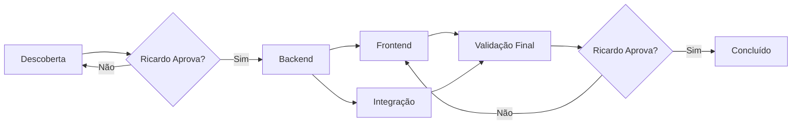

# 📋 PROCESSO DE INTEGRAÇÃO DE MÓDULOS - FLUYT

> **Última atualização:** 2025-01-26  
> **Objetivo:** Padronizar e organizar o processo completo de integração de novos módulos

## 🎯 VISÃO GERAL

Este documento define o processo completo para integrar um novo módulo ao sistema Fluyt, desde a descoberta da estrutura no banco até a validação final com dados reais.

## ⚠️ IMPORTANTE: PAPEL DO CLAUDE CODE

### **O que Claude Code FAZ:**
- ✅ **ANALISA** requisitos e estruturas existentes
- ✅ **CRIA** documentação detalhada (arquivos de missão)
- ✅ **DELEGA** tarefas para IAs especializadas
- ✅ **REVISA** código implementado pelas equipes
- ✅ **ATRIBUI NOTA** (1-10) com critérios de sênior
- ✅ **DECIDE** se cria demanda de refatoração ou refatora

### **O que Claude Code NÃO FAZ:**
- ❌ **NÃO implementa** código diretamente
- ❌ **NÃO edita** arquivos .py, .tsx, .ts
- ❌ **NÃO executa** comandos npm, pip, etc
- ❌ **NÃO faz** commits no git

### **Processo de Revisão e Nota:**
1. **Revisa código** implementado pela equipe
2. **Atribui nota 1-10** (como sênior conservador)
3. **Se nota < 7:** Cria demanda detalhada de refatoração
4. **Se nota ≥ 7 com ajustes pequenos:** Pode refatorar diretamente
5. **Sempre pergunta ao Ricardo** antes de refatorar

### **Papéis e Responsabilidades**

| Papel | Responsável | Função |
|-------|-------------|---------|
| **Gerente** | Claude Code | Coordena, analisa, documenta e revisa |
| **Backend** | IA Backend | Implementa API REST (Python/FastAPI) |
| **Frontend** | IA Frontend | Implementa interface (Next.js/React) |
| **Integração** | IA Testes | Valida fluxo completo e testes |
| **Aprovador** | Ricardo | Valida cada fase antes de prosseguir |

### **Fluxo Visual**



---

## 📊 FASE 1: DESCOBERTA E VALIDAÇÃO

**Responsável:** Claude Code (Gerente)  
**Duração:** 1-2 horas  
**Gate:** Aprovação do Ricardo

### **Objetivos**
- Entender estrutura real da tabela no Supabase
- Mapear relacionamentos com outras tabelas
- Identificar diferenças entre backend e frontend
- Validar viabilidade técnica

### **Checklist de Descoberta**

#### 1.1 Análise do Banco via MCP
```python
# Descobrir tabela real
python3 -c "
from core.database import get_database
db = get_database()
# Verificar se tabela existe e estrutura
"
```

- [ ] Nome real da tabela identificado
- [ ] Campos e tipos mapeados
- [ ] Constraints e índices documentados
- [ ] RLS (Row Level Security) analisado

#### 1.2 Análise do Frontend
```bash
# Verificar interfaces TypeScript
grep -r "interface.*[Modulo]" Frontend/src/types/
```

- [ ] Interfaces TypeScript localizadas
- [ ] Campos do formulário mapeados
- [ ] Conversão camelCase ↔ snake_case identificada

#### 1.3 Mapeamento de Relacionamentos
- [ ] Foreign keys identificadas
- [ ] Tabelas relacionadas mapeadas
- [ ] Hierarquia definida (ex: Empresa → Loja → Setor)
- [ ] Multi-tenant considerado (isolamento por loja)

#### 1.4 Documento de Validação
```markdown
## DESCOBERTA - MÓDULO [NOME]

### Tabela Principal
- Nome: cad_[modulo]
- Campos: [lista completa]

### Relacionamentos
- Relaciona com: [tabelas]
- Tipo: [1:N, N:N, etc]

### Diferenças Backend x Frontend
| Frontend | Backend | Ação |
|----------|---------|------|
| campo | campo_id | Converter |

### Riscos Identificados
- [Lista de possíveis problemas]
```

### **🔴 GATE: Apresentar descoberta ao Ricardo**
- Aguardar aprovação antes de prosseguir
- Ajustar conforme feedback
- Documentar decisões tomadas

---

## ⚙️ FASE 2: IMPLEMENTAÇÃO BACKEND

**Responsável:** IA Backend  
**Duração:** 3-4 horas  
**Gate:** API funcionando com testes
**Dependências:** Fase 1 aprovada

### **Objetivos**
- Criar estrutura completa do módulo backend
- Implementar CRUD com validações
- Respeitar padrões estabelecidos
- Entregar API REST testável

### **Arquivos a Criar**

```
backend/modules/[modulo]/
├── __init__.py
├── schemas.py      # Estruturas Pydantic
├── repository.py   # Acesso ao banco
├── services.py     # Lógica de negócio
└── controller.py   # Endpoints FastAPI
```

### **Checklist Backend**

#### 2.1 Schemas (schemas.py)
- [ ] BaseModel com campos obrigatórios/opcionais
- [ ] Validações customizadas (@field_validator)
- [ ] Classes: Create, Update, Response, ListResponse
- [ ] Filtros para listagem

#### 2.2 Repository (repository.py)
- [ ] CRUD completo (Create, Read, Update, Delete)
- [ ] Soft delete implementado
- [ ] Queries otimizadas (evitar N+1)
- [ ] Tratamento de exceções específicas
- [ ] Multi-tenant se aplicável

#### 2.3 Services (services.py)
- [ ] Validações de negócio
- [ ] Verificação de permissões
- [ ] Integração com repository
- [ ] Logs adequados

#### 2.4 Controller (controller.py)
- [ ] Endpoints RESTful padrão
- [ ] Documentação OpenAPI
- [ ] Paginação implementada
- [ ] Filtros funcionando
- [ ] Autenticação obrigatória

### **Padrões Obrigatórios**
- Usar módulo **Lojas** como referência
- Comentários em PT-BR
- Exceptions customizadas
- Logs em pontos críticos

### **Testes Básicos**
```bash
# Testar endpoints
curl -X GET http://localhost:8000/api/v1/[modulo]
curl -X POST http://localhost:8000/api/v1/[modulo]
```

### **🟡 GATE: Backend funcionando**
- Endpoints respondendo corretamente
- CRUD completo testado
- Pode liberar Frontend e Integração

---

## 🎨 FASE 3A: IMPLEMENTAÇÃO FRONTEND

**Responsável:** IA Frontend  
**Duração:** 4-5 horas  
**Gate:** Interface funcionando com dados reais
**Dependências:** Backend pronto

### **Objetivos**
- Remover TODOS os dados mockados
- Conectar com API real do backend
- Implementar UI/UX consistente
- Integrar com gerenciamento de estado

### **Componentes a Criar/Atualizar**

```
Frontend/src/
├── types/[modulo].ts           # Interfaces TypeScript
├── hooks/modulos/[modulo]/     # Hooks customizados
├── components/modulos/[modulo]/ # Componentes React
├── services/[modulo]-service.ts # Chamadas API
└── store/[modulo]-store.ts     # Estado Zustand
```

### **Checklist Frontend**

#### 3.1 Tipos e Interfaces
- [ ] Interfaces alinhadas com backend
- [ ] Conversão camelCase implementada
- [ ] Tipos para filtros e paginação

#### 3.2 Serviços
- [ ] Integração com apiClient
- [ ] Tratamento de erros
- [ ] Conversão de dados automática
- [ ] Cache quando apropriado

#### 3.3 Componentes
- [ ] Listagem com tabela/cards
- [ ] Formulário de criação/edição
- [ ] Modal de confirmação para exclusão
- [ ] Filtros e busca
- [ ] Loading states
- [ ] Empty states
- [ ] Error boundaries

#### 3.4 Estado e Store
- [ ] Store Zustand criada
- [ ] Actions CRUD implementadas
- [ ] Loading/error states
- [ ] Persistência quando necessário

### **Remoção de Mocks**
```typescript
// ❌ REMOVER
const mockData = [{ id: 1, name: 'Teste' }];

// ✅ SUBSTITUIR POR
const { data, loading, error } = useModulo();
```

### **UI/UX Consistente**
- Usar componentes do Shadcn/ui
- Seguir padrões visuais existentes
- Responsividade obrigatória
- Feedback visual para ações

### **🟡 GATE: Frontend funcionando**
- Telas carregando dados reais
- CRUD funcionando visualmente
- Sem erros no console

---

## 🧪 FASE 3B: TESTES E INTEGRAÇÃO

**Responsável:** IA Testes  
**Duração:** 2-3 horas  
**Gate:** Testes passando
**Dependências:** Backend pronto
**Pode executar em paralelo com Frontend**

### **Objetivos**
- Criar suite de testes completa
- Validar integração frontend-backend
- Documentar casos de uso
- Garantir segurança e performance

### **Tipos de Testes**

#### 4.1 Testes de API
- [ ] Testes de endpoints (Postman/Insomnia)
- [ ] Validação de schemas
- [ ] Casos de erro (400, 401, 403, 404, 500)
- [ ] Limites e paginação

#### 4.2 Testes de Integração
- [ ] Fluxo completo CRUD
- [ ] Validação de permissões por perfil
- [ ] Multi-tenant (isolamento por loja)
- [ ] Relacionamentos funcionando

#### 4.3 Testes de Performance
- [ ] Queries sem N+1
- [ ] Tempo de resposta adequado
- [ ] Paginação eficiente
- [ ] Cache quando aplicável

#### 4.4 Testes de Segurança
- [ ] Autenticação obrigatória
- [ ] Autorização por perfil
- [ ] SQL Injection prevention
- [ ] XSS prevention

### **Documentação de Testes**
```markdown
## TESTES - MÓDULO [NOME]

### Casos de Sucesso
1. Criar registro: [passos]
2. Listar com filtros: [passos]
3. Atualizar parcial: [passos]
4. Excluir (soft): [passos]

### Casos de Erro
1. Criar duplicado: [resultado esperado]
2. Acessar sem permissão: [resultado]
3. Dados inválidos: [validações]

### Performance
- Listagem 100 registros: [tempo]
- Query com joins: [otimizada?]
```

### **🟡 GATE: Testes aprovados**
- Todos os testes passando
- Performance adequada
- Segurança validada

---

## ✅ FASE 4: VALIDAÇÃO FINAL

**Responsável:** Claude Code (Gerente)  
**Duração:** 1-2 horas  
**Gate:** Aprovação final do Ricardo
**Dependências:** Frontend + Integração prontos

### **Objetivos**
- Validar sistema completo funcionando
- Verificar qualidade do código
- Confirmar dados reais do Supabase
- Preparar para produção

### **Checklist Final**

#### 5.1 Funcionalidades
- [ ] CRUD completo funcionando
- [ ] Filtros e busca operacionais
- [ ] Paginação correta
- [ ] Ordenação funcionando
- [ ] Validações aplicadas

#### 5.2 Qualidade
- [ ] Código comentado em PT-BR
- [ ] Sem console.log desnecessários
- [ ] Tratamento de erros completo
- [ ] Loading states adequados
- [ ] Mensagens em português

#### 5.3 Integração
- [ ] Dados reais do Supabase
- [ ] Sem mocks em produção
- [ ] Cache invalidado corretamente
- [ ] Estados sincronizados

#### 5.4 Segurança
- [ ] Permissões testadas por perfil
- [ ] Multi-tenant funcionando
- [ ] Sem vazamento de dados
- [ ] Logs de auditoria

### **Demonstração para Ricardo**
1. Criar novo registro
2. Listar com filtros
3. Editar registro existente
4. Excluir com confirmação
5. Mostrar validações
6. Testar permissões

### **🟢 GATE: Aprovação Final**
- Ricardo testa pessoalmente
- Feedback incorporado
- Pronto para produção

---

## 📊 PROCESSO DE REVISÃO E NOTA (CLAUDE CODE)

### **Critérios de Avaliação (Visão Sênior Conservador)**

| Critério | Peso | Descrição |
|----------|------|-----------|
| **Funcionalidade** | 30% | Funciona conforme especificado? |
| **Qualidade do Código** | 25% | Limpo, manutenível, sem gambiarras? |
| **Performance** | 20% | Otimizado, sem N+1, resposta rápida? |
| **Segurança** | 15% | Validações, permissões, sem vulnerabilidades? |
| **Documentação** | 10% | Comentários, tipos, fácil entender? |

### **Escala de Notas**

- **9-10:** Excelente, pronto para produção
- **7-8:** Bom, pequenos ajustes necessários
- **5-6:** Regular, precisa refatoração moderada
- **3-4:** Ruim, refatoração significativa
- **1-2:** Crítico, reescrever do zero

### **Processo de Decisão**

```
NOTA >= 7 com ajustes pequenos?
├── SIM → Claude pergunta: "Posso refatorar diretamente?"
│   ├── Ricardo SIM → Claude refatora
│   └── Ricardo NÃO → Claude cria demanda
└── NÃO → Claude cria demanda detalhada de refatoração
```

### **Template de Revisão**

```markdown
## REVISÃO - MÓDULO [NOME]

### Nota Final: X/10

### Análise por Critério:
- Funcionalidade: X/10 - [justificativa]
- Código: X/10 - [justificativa]
- Performance: X/10 - [justificativa]
- Segurança: X/10 - [justificativa]
- Documentação: X/10 - [justificativa]

### Problemas Encontrados:
1. [Problema 1 - Severidade]
2. [Problema 2 - Severidade]

### Recomendação:
[ ] Aprovado como está
[ ] Pequenos ajustes (posso fazer)
[ ] Refatoração necessária (criar demanda)

Ricardo, como deseja proceder?
```

---

## 📈 CONTROLE DE PROGRESSO

### **Template de Status**
```markdown
## STATUS - MÓDULO [NOME]

### ✅ CONCLUÍDO
- [ ] Fase 1: Descoberta

### 🔄 EM PROGRESSO
- [ ] Fase 2: Backend (50%)

### 🔒 BLOQUEADO
- [ ] Fase 3A: Frontend (aguarda backend)
- [ ] Fase 3B: Integração (aguarda backend)
- [ ] Fase 4: Validação (aguarda 3A e 3B)

### 📅 TIMELINE
- Início: [data]
- Previsão: [data]
- Bloqueios: [descrição]
```

---

## 🚨 REGRAS IMPORTANTES

1. **NUNCA** pular fases ou gates
2. **SEMPRE** usar módulos existentes como referência
3. **REMOVER** todos os mocks antes de entregar
4. **DOCUMENTAR** decisões e mudanças
5. **TESTAR** antes de marcar como pronto

---

## 📚 REFERÊNCIAS

- **Módulo Exemplo:** `/backend/modules/lojas/`
- **Frontend Exemplo:** `/Frontend/src/components/modulos/lojas/`
- **Tipos:** `/Frontend/src/types/`
- **Documentação API:** `http://localhost:8000/docs`

---

**Este processo garante qualidade, rastreabilidade e sucesso na integração de novos módulos!**