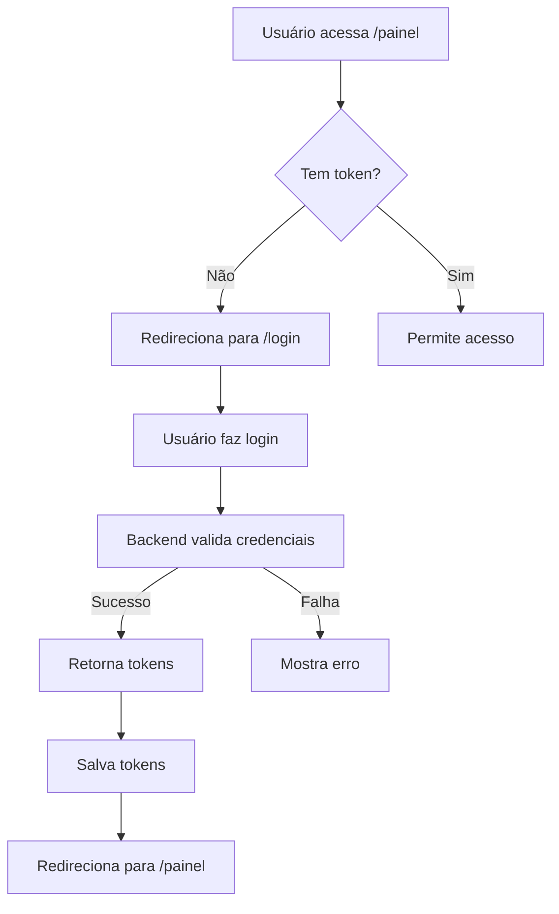

# Integração de Autenticação - Fluyt Comercial

## Resumo das Implementações

### 1. Página de Login (`/src/app/login/page.tsx`)
- Interface de login com email e senha
- Integração com endpoint `/api/v1/auth/login`
- Armazenamento de tokens em localStorage e cookies
- Redirecionamento após login bem-sucedido
- Credenciais de teste exibidas na interface

### 2. API Client Aprimorado (`/src/services/api-client.ts`)
- **Autenticação Automática**: Carrega token do localStorage ao inicializar
- **Headers com Token**: Adiciona automaticamente `Authorization: Bearer` em todas requisições
- **Renovação de Token**: Detecta erro 401 e tenta renovar token automaticamente
- **Logout Completo**: Limpa tokens do localStorage e cookies

### 3. Middleware de Proteção (`/src/middleware.ts`)
- Protege rotas que começam com `/painel`
- Verifica token nos cookies antes de permitir acesso
- Redireciona para login se não autenticado
- Preserva URL original para retornar após login

### 4. Indicador de Status (`/src/components/layout/connection-status.tsx`)
- Mostra status Online/Offline na sidebar
- Verifica conectividade com backend a cada 30 segundos
- Detecta mudanças de conexão automaticamente
- Visual distintivo para cada estado

## Fluxo de Autenticação



## Segurança Implementada

1. **Tokens JWT**: Access token para requisições, refresh token para renovação
2. **Middleware**: Proteção server-side de rotas
3. **Auto-renovação**: Token renovado automaticamente quando expira
4. **Logout seguro**: Limpa todos os dados de autenticação

## Como Testar

1. **Iniciar Backend**:
   ```bash
   cd backend
   python main.py
   ```

2. **Iniciar Frontend**:
   ```bash
   npm run dev
   ```

3. **Acessar Sistema**:
   - Abra http://localhost:3000/painel
   - Será redirecionado para login
   - Use credenciais de teste ou crie novo usuário
   - Após login, terá acesso ao sistema

## Próximos Passos

1. ✅ Autenticação básica implementada
2. ⏳ Implementar registro de novos usuários
3. ⏳ Adicionar recuperação de senha
4. ⏳ Implementar controle de permissões por perfil
5. ⏳ Adicionar logout no menu do usuário